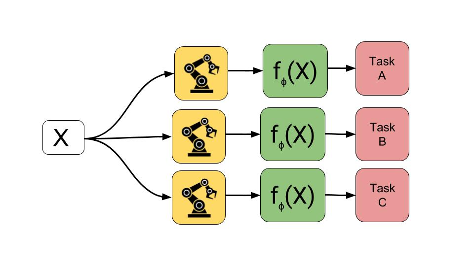
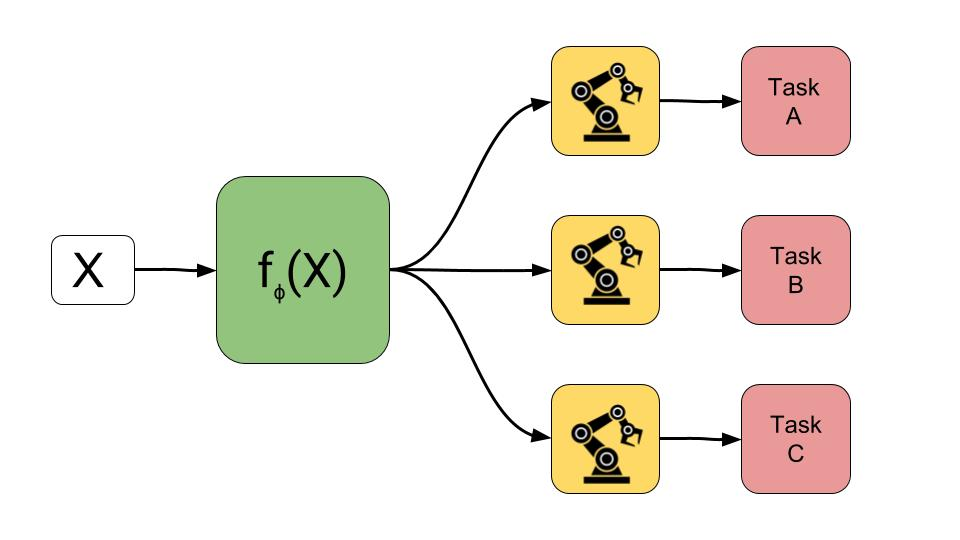
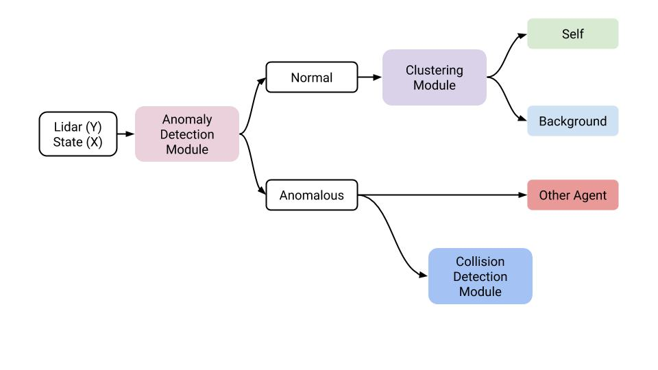

# Unsupervised Perception of Dynamic Environments

Simple observation: Machine Learning for Robotics doesn't (yet) work. Why? And most important, can we do something to fix this problem?

Question: Is it possible to sense a dynamic environment using learning techniques?

Answer: Yes, but we need some assumptions.

## Geometry based and Learning based approach

|                              |                              |
| ------------------------------------------------------------ | ------------------------------------------------------------ |
| Geometry based approach: we build a specific model of our system, and on top of it we use machine learning to solve specific tasks. | Learning based approach: we build a statistical model, and on top of it we inject geometrical constraints and task dependent informations. |

The Robotic field was historically reluctant to use Machine Learning techniques. With the advent of Deep Learning, the situation isn't improved. And it's easy to understand why! Typically in Robotics we deal with tasks well defined: applying Geometry, Control theory and lot of engineering, it's possible to obtain impressive practical results: why should we use methods that are approximated, without clear convergence and obscure?

Difficult to debate with them, I agree. No need for Machine Learning, we only need curve fitting for specific tasks; we have a sufficient amount of Machines already. So done? Not so fast! 

Let's say that the task is not so well defined; let's say that we don't have perfect knowledge of our robotic agents; and in particular, let's say that we live in a Dynamic Environment. That's it: in real life, things can change around us in any moment. For this scenario, classical methods are not sufficient. Now Machine Learning can help.

We decided to explore this idea and to answer a simple question: how to deal with an Environment that evolves continuously? How to deal with Dynamics in our environment ?

We decided to explore the possibility to perceive a Dynamic Environment using Machine Learning.

It was immediately clear that a classical Supervised approach was not well suited for this task: classification algorithms assume same data distribution between train and test set (it is possible to work with Domain Adaptation techniques, but they assume always some similarity in terms of distribution). So we started to think to use Unsupervised Learning, a form of ML that learns structure in data without labels. The idea was nice, but...we cannot output a number and stop...we needed also to consider some form of uncertainty around our prediction. However, we are trying to predict something in an Environment that changes, and we don't know how it will change!

## Preliminary

After some brainstorming with our mentor, the path was clear: we decided to build a sensing framework, using unsupervised learning techniques, in a statistical setup.

Before to continue it's important to clarify the difference between Geometry based and Learning based approach.

Now we needed only: data, model, GPU, and a lot of hard work!

Instead to conjecture, we decided to start collecting data and see if it was possible to detect some patterns. The first result was cheering: collecting lidar data on a given trajectory, we started to see a clear multi modal pattern.

|                       |
| :----------------------------------------------------------: |
| Data collected moving the robotic arm on a given trajectory. For any lidar (9) we show the temporal trace and relative histogram with density estimation. |

So Multi modality? Why not to try with a Gaussian Mixture Model (GMM)? GMMs are a classical tool for statistical clustering and they seemed a perfect tool for our problem. In formula:
$$
\begin{align}
p(y) &= \sum_k \pi_k \mathcal P_k(y \vert \mu, \sigma)
\end{align}
$$
So we tried a simple GMM on a simplified scenario: we collected time-series data in static and dynamic environment; every sample is a 10 consecutive points in this time series; and we built a low dimensional handcrafted feature representation. In particular, given a time series x(t), we built a simple handcrafted feature representation using
$$
f(x) = (max;std)(|x(t+1) - x(t)|)
$$
the result was not bad: considering 20 samples (every sample consisting of short time series with 10 consecutive points), we were able to cluster correctly the 70 % of these points. 

|                               |       |
| ------------------------------------------------------------ | ----------------------------------------- |
| time series data in dynamic (red) and static (blue) environment | gmm clustering using handcrafted features |

Good! The preliminary results showed that, at least, it's not impossible to cluster these time series. Go on. It's time to build our model, that we, um-modestly, decided to call Sensing Framework. 

## Sensing Framework

The sensing framework is a hierarchical model and consists of three main Modules:

* Anomaly Detection Module
* Clustering Module
* Collision Detection Module

These three modules solve what we consider the most relevant perception tasks for a manipulator in Dynamics Environment: understand if there is something new or dynamic in the environment; if everything is normal, be able to distinguish between the background and itself; instead, if something is abnormal, distinguish between simply something new (agent moving, new object) and a possible collision.

As input for all the framework we have the 9 lidar readings, and the 7 joint position (we decide to not use joint velocity and torque because not necessary and not always available).

|                                   |
| ------------------------------------------------------------ |
| Pictorial view of our Perception Framework. Given input data sensor, we build a hierarchical learning pipeline to deal with complex Dynamic Environments. |

### Anomaly Detection Module

For anomaly detection we tried two models: a Variational Auto-encoder and a Regression model. In both cases the idea was to solve a proxy task (reconstruction for the vae, prediction for the regression) to obtain an anomaly detector: after training, when the model is not able to reconstruct or predict a given sample point, we consider this point an anomaly. Simple and effective. In the end we decide to use the Regression model: it was simple to train and we obtained good enough results. 
$$
\begin{align}p(Y \vert X) 
&= \prod_i p(y_i \vert x_i)\\
&= \prod_i\prod_j \mathcal N(y_{ij}^{lidar} \vert \mu_{j}^{lidar}(x_i), \sigma_j^{lidar}(x_i)^2) \times \prod_{s,t} \mathcal N(y^{depth}_{i,st} \vert \mu^{depth}_{st}(x_i),\sigma^{depth}(x_i)^2 )
\end{align}
$$
and relative loss
$$
L(Y, X, \lambda)= - \sum_i \log p(y_i \vert x_i)
$$

|                                     |
| :----------------------------------------------------------: |
| anomaly detection in action. We inject anomalies in the environment, and the model is not able to predict the new behavior. |

###  Clustering Module

After the Anomaly Detection module, we have a Clustering Module in our pipeline: if the ADM detects a normal behavior, we analyze this data with the CM to decide if it is background or self. To obtain this result we built and test a series of statistical models with increasing complexity. In this section, We present the two most promising: the selector model and the deep gaussian mixture model with data dependent moments.

we consider the 9 lidars iid (a reasonable assumption give the correlation matrix that we computed) and we build probabilistic models to fit the data. In particular we have interest in learning the moments of 9 one dimensional multi modal Gaussian (with two modes: self and background)

### selector

$$
\begin{align}
p(Y \vert X) 
&= \prod_i p(y_i \vert x_i)\\
&= \prod_i p(y_i^{lidar} \vert x_i)\times p(y_i^{depth} \vert x_i)\\ 
&= \prod_i\prod_j \mathcal N(y_{ij}^{lidar} \vert \sum_k \pi_{jk}^{lidar}(x_i)\mu_{jk}^{lidar}(x_i), \sum_k \pi_{jk}^{lidar}(x_i)\sigma_{jk}^{lidar}(x_i)^2) \\
&\times \prod_{s,t} \mathcal N(y^{depth}_{i,st} \vert \sum_k \pi_{st,k}^{depth}(x_i) \mu^{depth}_{st,k}(x_i), \sum_k \pi_{st,k}^{lidar}(x_i)\sigma^{depth}_{k}(x_i)^2 )
\end{align}
$$

|                                  |
| :----------------------------------------------------------: |
| clustering on a controlled experiment: the top row shows the lidar 3 seeing itself; lidar 4 is seeing another agent. |

With this model, on a ground truth of 3000 points manually labeled, we obtain an accuracy of 70 %.

### Gaussian Mixture Model

$$
\begin{align}
p(Y \vert X) 
&= \prod_i p(y_i \vert x_i)\\
&= \prod_i p(y_i^{lidar} \vert x_i)\times p(y_i^{depth} \vert x_i)\\ 
& = \prod_i\prod_j [\sum_k \pi_{jk}^{lidar}(x_i) \mathcal N(y_{ij}^{lidar} \vert \mu_{jk}^{lidar}(x_i),\sigma_{jk}^{lidar}(x_i)^2) \\
&\times \prod_{s,t}[\sum_k \pi_{st,k}^{depth}(x_i) \mathcal N(y^{depth}_{i,st} \vert \mu^{depth}_{st,k}(x_i), \sigma^{depth}_{k}(x_i)^2 )]
\end{align}
$$
and relative loss

$$
L(Y, X, \lambda)= -\sum_i \log p(y_i \vert x_i) - \lambda \sum_i\sum_k\pi_k(x_i) \log \pi_k(x_i) -\gamma \sum_i\sum_k c_{ik} \log \pi_k(x_i)
$$

### Collision Detection Module

This part is a simple module for binary classification. Given our Unsupervised approach (i.e. we don't label data), how can we train a classifier? Well thanks to a smart trick that we called negative sampling: In practice, we consider batches of 10 consecutive time series point; we randomly choose columns and set that values to Gaussian noise around a small value (let's say 50 mm). We label any original data point class 0, and any modified data point 1: in this way we want to discriminate between a generic anomaly (something new in the environment, other agent acting) and a probable collision. We now train/test on this dataset and we evaluate the result considering a global result and a per lidar result (we solve a binary classification problem for every lidar). Computing the Confusion matrix for a test set sample of 2000 points,  we evaluate the classification result using the Jaccard index. 

We report results for the class of interest (collision or class 1):

| metrics/Lidar | 0    | 1    | 2    | 3    | 4    | 5    | 6    | 7    | 8    |
| ------------- | ---- | ---- | ---- | ---- | ---- | ---- | ---- | ---- | ---- |
| N             | 100  | 180  | 140  | 180  | 100  | 170  | 200  | 160  | 180  |
| Sensitivity   | 96.0 | 33.3 | 22.1 | 56.1 | 84.0 | 97.0 | 22.0 | 20.6 | 57.2 |
| IoU           | 92.3 | 32.6 | 20.0 | 50.5 | 73.6 | 91.6 | 19.5 | 17.5 | 50.2 |
| F1            | 96.0 | 49.1 | 33.3 | 67.1 | 84.8 | 95.6 | 32.7 | 29.8 | 66.8 |

