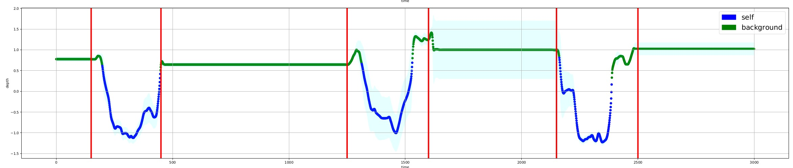

# Unsupervised Classification of Sensor Readings

* Team: **THE BORING PANDA**
* Members: Daniel & Giorgio

For this Challenge, the argmax.ai group gave us a 7 degree of freedom Panda robotic arm. The robot possesses 9 single point lidars and an RGBD camera on the end-effector. Thanks to a Python API, we can easily control the robotic arm point to point, read sensor data and receive information about the robot state.

Our goal for the Robotic Challenge was:

**Classify each data reading as self, background or other using Unsupervised/Semi-Supervised Learning techniques.**

We hypothesized that the perception task can be solved without relying explicitly on geometry and configuration.

## Background

When we started to work on this project, one month ago, we decided to focus on the Machine Learning part.  Moreover, reading papers, a simple observation arose naturally: Machine Learning for Robotics works in specific cases, and it is challenging to generalize. We tried to understand why.

### Geometry based and Machine Learning based approach

Typically in Robotics we deal with tasks well defined. It is possible to obtain impressive results applying Geometry, Control theory and engineering. In a traditional setup, we don't need Learning.

|                              |                              |
| ------------------------------------------------------------ | ------------------------------------------------------------ |
| Geometry based approach: we build a specific model of our system, and on top of it we use machine learning to solve specific tasks. | Learning based approach: we build a statistical model, and on top of it we inject geometrical constraints and task-dependent information. |

But assume that the task is not so well defined; that we don't have perfect knowledge of our agent; and that we need to deal with a not static environment. This last hypothesis is not only a theoretical assumption, and it's particularly relevant considering that more and more robots are interacting with us in environments that typically evolve. For this new scenario, classical methods are not sufficient. Now Statistical Methods can be helpful.

### Statistical Modeling

It became immediately clear that a Supervised approach that relies on manual labeling and strong supervision was not well suited for this task. The manual labeling for sensor reading is not trivial and not always objective (imagine that you need to label thousands of data points every second). Moreover, discriminative algorithms assume the same data distribution between train and test set (it is possible to work with Domain Adaptation techniques, but they always assume some distribution similarity). Also, they typically output a number. All features that are not good in Robotics, where domain shift and uncertainty are the norms.

We decided to use **Statistical Unsupervised Learning**, a class of Machine Learning algorithms that learn structure in data without manual labeling. With one model we can sense the environment without using complex heuristics to label sensor data and quantify uncertainty around our prediction.

### Data Analysis

We started to collect data and see if it was possible to detect some patterns. The first result was cheering: collecting lidar data on a given trajectory, we started to see a clear multi-modal pattern.

|                       |
| :----------------------------------------------------------: |
| Data collected moving the robotic arm on a given trajectory. For any lidar, we show the temporal trace in mm and the relative histogram with density estimation. |

|             |
| ------------------------------------------------------------ |
| Controlled experiment to analyze different patterns for background, self and other. |

Given this behavior, we decided to try with a Mixture Model. The general idea is that we can express the complex structure of $y$ in terms of a weighted combination of simpler (possibly known) densities. So we tried a simple Gaussian Mixture Model on a simplified scenario: we collected time-series data in a static and a dynamic environment; every sample is 10 consecutive points in this time series; we built a low dimensional handcrafted feature representation. In particular, given a time series $x(t)$, we built a simple handcrafted feature representation using [max;std] of the following simple (non-linear) data transformation. We can think to this $f(x_t)$ as a temporal difference
$$
f(x_t) = \vert x(t+1) - x(t) \vert
$$
The result was good: considering 30 samples (every sample consisting of short time series with 10 consecutive points), we were able to cluster correctly 70 % of these points. Moreover, the misclassified samples are the dynamic one indistinguishable from the static one in this embedding space. 

|                                      |  |
| ------------------------------------------------------------ | -------------------------- |
| time series data embedding for dynamic (red) and static (blue) environment | gmm clustering prediction  |

Given that we can cluster with handcrafted features, using deep learning and statistics, we should be able to find a representation space to solve our perception task. We started to build our model on this basis.

## Model

### Definitions

Before to start, some definitions:

* $(y_i, x_i)$ is a sample
* $y_{i j}$ is a lidar reading
* $y_{i, s t}$ is a pixel in a depth image
* $x_i$ is the state of the robot; typically joint angle positions and velocities
* $\pi_k$ is a clustering selector

### The Sensing framework

The sensing framework is a hierarchical statistical learning model and consists of three main Modules:

* Anomaly Detection Module
* Clustering Module
* Collision Detection Module

These three modules solve what we consider the most relevant perception tasks for a manipulator: understand if there is something new in the environment; if everything is normal, be able to distinguish between background and itself; instead, if something is abnormal, distinguish between something new (agent moving, a new object) or a possible collision.

As input for all the framework, we have the 9 lidar readings, and the 7 joint positions (we decide to not use joint velocity). We also built variants of these models to deal with depth images used as sensor input or to help the lidar clustering.

|                                   |
| ------------------------------------------------------------ |
| Pictorial view of our Perception Framework. Given input data sensor, we build a hierarchical learning pipeline to deal with complex Dynamic Environments. |

### Anomaly Detection Module

For anomaly detection, we decided to use a Regression model. The statistical model is Normal. The idea is to solve a proxy task (prediction) to obtain an anomaly detector: after training, when the model is not able to reconstruct or predict a given sample point, we consider this point an anomaly. Simple and effective! 

We used a multilayer perceptron with two 256 unit layers and hyperbolic tangent as activation. This network outputs two objects: 9 means (one for every lidar), and more important, 9 standard deviations. The network is trained to minimize the negative log-likelihood. In this way, we can not only detect an anomaly, but we can quantify the uncertainty (building a confidence interval) for our prediction, and we use this confidence interval to decide if a point is an anomaly or not. We don't need to use heuristics, because the probability to be an outlier is directly linked with how well the model fits the data.

Given a sample $Y \vert X$, the distribution of $Y \vert X$ can be expressed as a product of their iid sample points. For any sample point $i$, we have lidars $j$ and depth images, with pixels $s, t$
$$
\begin{align}p(Y \vert X) 
&= \prod_i p(y_i \vert x_i)\\
&= \prod_i\prod_j \mathcal N(y_{ij}^{lidar} \vert \mu_{j}^{lidar}(x_i), \sigma_j^{lidar}(x_i)^2) \times \prod_{s,t} \mathcal N(y^{depth}_{i,st} \vert \mu^{depth}_{st}(x_i),\sigma^{depth}(x_i)^2 )
\end{align}
$$
$$
L(Y, X)= - \sum_i \log p(y_i \vert x_i)
$$

|                                |
| :----------------------------------------------------------: |
| Lidar n.3 reading. We inject anomalies in the environment, and the model is not able to predict the new behavior. |

###  Clustering Module

If the Anomaly Detector Module detects an anomaly, we have done. However, if it detects a normal behavior, now we need to use the Clustering Module to decide if it is background or self. To obtain this result, we built what we called a selector model, a network that mimics the Gaussian mixture model' s behavior. Again we solve a proxy task (a prediction) to solve a clustering task. We train with maximum likelihood. In this case, for lidars readings, we have an interest in learning the moments of  9 one dimensional multi modal Gaussian with two modes: self and background. We input a short time series of 10 consecutive points: in this way, we help the model to learn the temporal dynamics and we filter noise.

As before, the meaning of the symbols is the same. The selectors $\pi_{k}$ are the only novelty. These selectors represent the clustering probability for any sensor reading. For example, given 9 lidars, we need to output (9, 2) numbers.
$$
\begin{align}
p(Y \vert X) 
&= \prod_i p(y_i \vert x_i)\\
&= \prod_i p(y_i^{lidar} \vert x_i)\times p(y_i^{depth} \vert x_i)\\ 
&= \prod_i\prod_j \mathcal N(y_{ij}^{lidar} \vert \sum_k \pi_{jk}^{lidar}(x_i)\mu_{jk}^{lidar}(x_i), \sum_k \pi_{jk}^{lidar}(x_i)\sigma_{jk}^{lidar}(x_i)^2) \\
&\times \prod_{s,t} \mathcal N(y^{depth}_{i,st} \vert \sum_k \pi_{st,k}^{depth}(x_i) \mu^{depth}_{st,k}(x_i), \sum_k \pi_{st,k}^{lidar}(x_i)\sigma^{depth}_{k}(x_i)^2 )
\end{align}
$$

|                                     |
| :----------------------------------------------------------: |
| Clustering on a controlled experiment. Lidar n.3 reading. The red vertical lines represent the limit of ground truth for self. |

With this model, on a ground truth of 3000 labeled lidar point measurements, we obtained a global accuracy of 89.8 % and a recall (on the class of interest self) of 69.4 %.

### Collision Detection Module

We model this task as a simple multi-label binary classification: in practice, we consider batches of 10 consecutive time series point; we randomly chose columns and set that values to Gaussian noise around a small value (around 50 mm). We label any original data point class 0, and any modified data point 1: in this way we want to discriminate between a generic anomaly (something new in the environment, another agent acting) and a probable collision. We now train/test on this dataset and we evaluate the result considering a global result and a per lidar result (we solve a binary classification problem for every lidar). Computing the Confusion matrix for a test set sample of 2000 points,  we evaluate the classification result using the Jaccard index and the F1 metric. 

We report results for the class of interest (collision or class 1):

| metrics/Lidar | 0    | 1    | 2    | 3    | 4    | 5    | 6    | 7    | 8    | Avg   |
| ------------- | ---- | ---- | ---- | ---- | ---- | ---- | ---- | ---- | ---- | ----- |
| N             | 100  | 180  | 140  | 180  | 100  | 170  | 200  | 160  | 180  | 156.6 |
| Sensitivity   | 0.96 | 0.33 | 0.22 | 0.56 | 0.84 | 0.97 | 0.22 | 0.20 | 0.57 | 0.54  |
| IoU           | 0.92 | 0.32 | 0.20 | 0.50 | 0.73 | 0.91 | 0.19 | 0.17 | 0.50 | 0.49  |
| F1            | 0.96 | 0.49 | 0.33 | 0.67 | 0.84 | 0.95 | 0.32 | 0.29 | 0.66 | 0.61  |

​						Result on 2000 points with ground truth for collision detection

## Conclusions

In this work, we investigated the possibility to sense the environment using an unsupervised learning approach, without relying on a particular configuration or geometry. This approach showed Advantages and Drawbacks.

Regarding the advantages, in principle we can learn structures that we can reuse in different scenarios; and the capacity to quantify the prediction uncertainty because this approach is intrinsically statistical.

However, we didn't manage to solve the unsupervised classification task in a general sense; and the most significant drawback is that we are not able to interact easily with the environment; we can learn the perception task in simple environments, but is not straightforward how to use this knowledge and solve a specific task.

The model can be improved: in particular, to solve the perception task robustly, we want to use latent variable models to learn better data representation and sequence models to model the temporal dynamics.

## References

0)  [GitHub repository](https://github.com/georgosgeorgos/DLRC_2018)

1) [Variational Inference for On-line Anomaly Detection in High-Dimensional Time Series](https://arxiv.org/abs/1602.07109)

2) [ Deep unsupervised clustering with Gaussian mixture variational autoencoders](https://openreview.net/forum?id=SJx7Jrtgl)

3) [Learning by Association - A versatile semi-supervised training method for neural networks](https://arxiv.org/abs/1706.00909)

4) [Generative Ensembles for Robust Anomaly Detection](https://arxiv.org/abs/1810.01392)